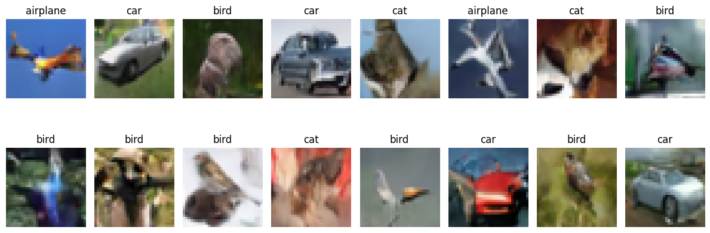
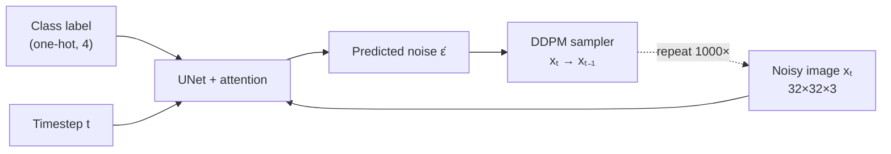

# ClassyDiffusion 🎨

**A class-conditional diffusion model written from scratch in TensorFlow/Keras. It generates 32×32 CIFAR-10 images of a class you pick.**


<sub>Output of `model.plot_images()` saved in the notebook. The title above each image is the class the model was asked to draw.</sub>

---

## Why this exists

Diffusion libraries hide the math. Here every piece is written by hand: the noise schedule, forward noising, reverse sampling, the UNet with attention, and the conditioning. There is no `diffusers` and no pretrained weights. The goal was to *understand* diffusion by building it.

## Key capabilities

- 🌫️ **DDPM forward/reverse process**: linear β schedule, T = 1000 steps
- 🧠 **UNet with self-attention**: ~64.8M parameters, attention at the 8×8 and 4×4 resolutions
- 🏷️ **Class conditioning**: a one-hot label (airplane · car · bird · cat) goes into every residual block
- 🎲 **Label dropout**: during training the label is zeroed out ~10% of the time
- 📉 **EMA weights**: sampling uses an exponential-moving-average copy of the network (decay 0.999)

## Architecture at a glance



## Tech stack

| | |
|---|---|
| Framework | TensorFlow 2 / Keras (exact version not pinned) |
| Data | `tensorflow_datasets` CIFAR-10, classes 0–3 → 20,000 images |
| Numerics / plots | NumPy · Matplotlib |
| Runtime | Kaggle GPU notebook (Python 3.10) |

## Quick start

The easiest route is Kaggle: open the [notebook](https://www.kaggle.com/code/anjumulazim/prompt-based-diffusion-model-with-attention) and click **Copy & Edit**.

To run it locally:

```bash
git clone https://github.com/onebelowall1218/ClassyDiffusion
cd ClassyDiffusion
pip install tensorflow tensorflow-datasets numpy matplotlib tqdm pandas
jupyter notebook prompt-based-diffusion-model-with-attention.ipynb
```

> [!WARNING]
> The notebook **loads saved checkpoints** from `/kaggle/working/models/`, and those files are not in this repo. For a fresh run, skip the `load_model(...)` cells. See [Common problems](docs/development.md#common-problems).

## 📚 Documentation

| Page | Read it for |
|------|-------------|
| [docs/index.md](docs/index.md) | 10-minute mental model: components, flow, decisions |
| [docs/architecture.md](docs/architecture.md) | Deep dive: UNet layout, data flow, failure points, scaling |
| [docs/development.md](docs/development.md) | Running, configuring, debugging the notebook |
