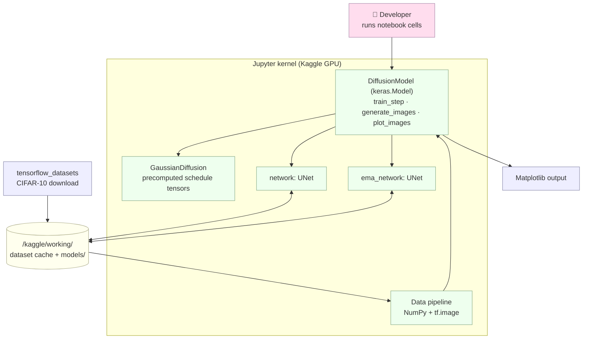
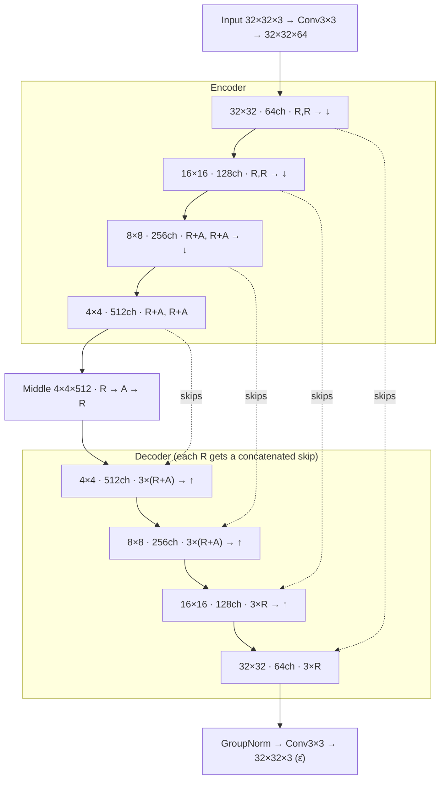
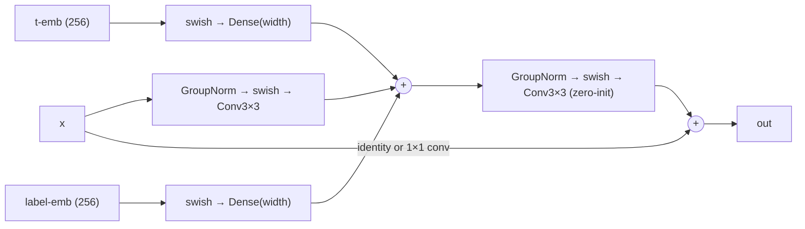
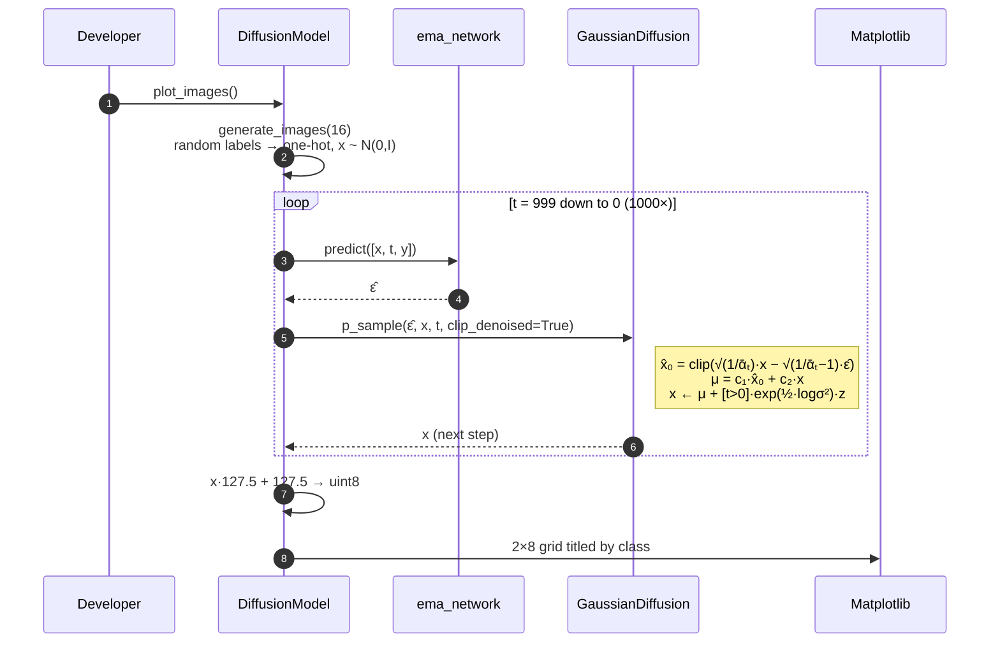
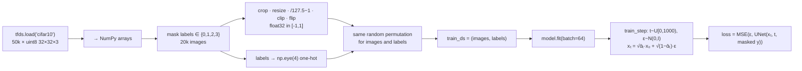
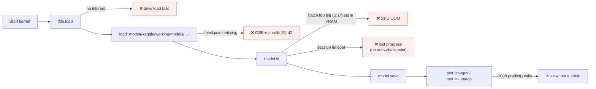

# Architecture

> Read [index.md](index.md) first for the mental model. This page covers the **how**: tensor shapes, state, failure points, and scaling.
>
> Everything runs inside **one Jupyter kernel**. There are no services, APIs, or databases. "Components" means Python classes and functions in the notebook. Cell numbers are 0-indexed.

---

## High-Level Architecture

## Component Responsibilities

| Component | Owns | Does **not** do |
|-----------|------|-----------------|
| **Data pipeline** (cells 9–16, 37–39) | Download, filter to labels 0–3, one-hot, center-crop and resize, scale to `[-1,1]`, flip, shuffle | Per-epoch augmentation, `tf.data` streaming |
| **`GaussianDiffusion`** (cell 17) | β schedule and derived constants (ᾱ, √ᾱ, posterior coefficients). `q_sample`, `predict_start_from_noise`, `q_posterior`, `p_sample` | Has no trainable weights and never calls the network |
| **`build_model`** (cell 18) | Keras functional UNet `[image, t, label] → ε̂` | Diffusion math |
| **`DiffusionModel`** (cell 20) | Training loop step, label dropout, EMA update, sampling loop, plotting | Checkpointing (done by hand in other cells) |
| **`text_to_image`** (cell 31) | Sampling with labels supplied by the caller | Guidance, batching beyond one call |

---

## UNet Layout

Shapes are for a 32×32×3 input. **R** = `ResidualBlock`, **A** = `AttentionBlock`.

**Inside one `ResidualBlock`** (this is where conditioning enters):

- **Timestep embedding:** sinusoidal, dim 256 → `TimeMLP` (Dense 256 swish → Dense 256).
- **Label embedding:** the one-hot (4) goes through `TextMLP` (Dense 256 swish → Dense 256). `TextEmbedding` is an identity function.
- **Attention:** single head. Q, K, and V are `Dense(units)` on GroupNorm-ed features, with softmax over all H·W positions and a zero-initialized output projection.
- **Zero-init** (`kernel_init(0.0)`) on the last conv of each residual block, the attention projection, and the output conv. Each block therefore starts close to identity.

> [!NOTE]
> Two deviations from the reference DDPM UNet, confirmed in the code:
> 1. `AttentionBlock` returns `norm(x) + proj`. The residual is added to the **normalized** input, not the raw `x`.
> 2. The output head is `GroupNorm → Conv`, **with no swish** between them.
>
> Both still train. Whether they affect quality is untested.

---

## Request Lifecycle: generating images

The most important "request" is: *"draw 16 images of random classes"* (`model.plot_images()`).

## Data Flow

**Label dropout detail:** `apply_random_mask(y, 0.9)` keeps each element of the one-hot vector with probability 0.9. Only one element is non-zero, so each sample's label becomes all zeros ("unconditional") about 10% of the time.

---

## State Management

| State | Lives in | Changes when | Persisted? |
|-------|----------|--------------|-----------|
| Raw / filtered / processed dataset | Kernel memory (NumPy + `EagerTensor`) | Data cells run. Cell 37 re-runs preprocessing, which re-draws the flips | ❌ (TFDS cache on disk only) |
| Schedule constants | `GaussianDiffusion` `tf.constant`s | Never after construction | ❌ (recomputed) |
| `network` weights + Adam state | Keras model / optimizer | Every `train_step` | Weights: ✅ via `model.network.save(...)`. Optimizer: ❌ not saved separately |
| `ema_network` weights | Keras model | After every `train_step` | ✅ via `model.ema_network.save(...)` |
| RNG | TF / NumPy global | Every call | ❌ **No seeds are set**, so runs aren't reproducible |

**Persistence boundary:** `/kaggle/working/models/`. The notebook references `cifar10_text_model1_ema_network` and `cifar_10_text_model1_network` (loaded), and `…model4…` (saved). Note that the two paths use different spellings (`cifar10_` vs `cifar_10_`).

> [!IMPORTANT]
> Swapping in checkpoints with `load_model` replaces `model.network` and `model.ema_network` **after** `compile()`. The logged run trained fine this way. How Adam state behaves across this swap is **UNKNOWN / NEEDS VERIFICATION**.

## Async / Event Flow

Not applicable. Everything is synchronous and runs in one process. There are no callbacks (no `ModelCheckpoint` or LR schedule), no background jobs, and no queues.

---

## Failure Boundaries

| Boundary | Handling in code |
|----------|------------------|
| Dataset download | None. It relies on Kaggle internet being enabled (`isInternetEnabled: true` in the notebook metadata) |
| Missing checkpoints | None. The cell simply raises |
| Numerical edge cases | `log(max(var, 1e-20))` for posterior variance at t = 0. `clip_denoised=True` clips x̂₀ to `[-1,1]`. No noise is added at t = 0 |
| Long training | No callbacks. Saving is a manual cell after `fit` |

---

## Scaling Model

**Today:** one GPU, one process, whole dataset in RAM. The logged run took ~307 ms per step at batch 64.

| Dimension | Current bottleneck | At 10× | What would need to change |
|-----------|-------------------|--------|---------------------------|
| **Dataset size** (e.g. all CIFAR-10 or larger) | Full dataset converted to NumPy and held as tensors | 200k images × 32×32×3 float32 ≈ 2.5 GB. Feasible for CIFAR, but it breaks on bigger or higher-res data | Stream with `tf.data` (`map`/`shuffle`/`batch`/`prefetch`) and augment per batch |
| **Resolution** (64×64+) | Attention is O((H·W)²). The 256/512-channel levels dominate compute | The same attention levels now run at 16×16 and 8×8, roughly 16× more attention memory | Move attention to lower levels, use mixed precision, reduce widths |
| **Training throughput** | Single device, no `tf.function` tuning or mixed precision in the code | 10× data means about 10× wall-clock time | `tf.distribute.MirroredStrategy`, mixed precision, auto-checkpoint callbacks |
| **Sampling throughput** | 1000 sequential Python-level `predict()` calls | 10× images means about 10× time (batching helps up to VRAM limits) | Call the model directly inside a `tf.function` loop. Use DDIM or fewer steps |

No benchmarks exist beyond the single `model.fit` log.

---

## Architecture Decisions

| Decision | Why | Tradeoff | Evidence |
|----------|-----|----------|----------|
| DDPM with ε-prediction, linear β 1e-4→0.02, T=1000 | Canonical, well-understood setup | Slow sampling | `GaussianDiffusion.__init__`, `train_step` |
| Keras functional UNet built from closure-style blocks (`ResidualBlock(width)(inputs)`) | Readable, and `summary()` shows the whole graph | Blocks aren't reusable `Layer` objects, so every call creates new weights | `build_model`, cell 18 |
| Custom `train_step` inside `keras.Model` | Keeps `model.fit()` ergonomics while controlling noise and timestep sampling | Must unpack `data[0]` manually, and there's no `test_step` | `DiffusionModel.train_step` |
| Additive class conditioning in every residual block | Reuses the timestep-injection pattern. Cheap | Weaker than cross-attention for rich prompts | `ResidualBlock`, `TextMLP` |
| Label dropout (10%) | Prepares for classifier-free guidance | CFG is not implemented in the sampler | `apply_random_mask(…, 0.9)` |
| EMA copy (0.999) used for all sampling | Stabler samples | 2× parameter memory | `train_step` EMA loop, `generate_images` |
| Attention at 256/512-channel levels only | Controls O((H·W)²) cost | Less global context at high resolution | `has_attention = [False, False, True, True]` |
| One-time static preprocessing | Simple for a 20k-image dataset | Flip is fixed for a whole run | cells 16 / 37 |
