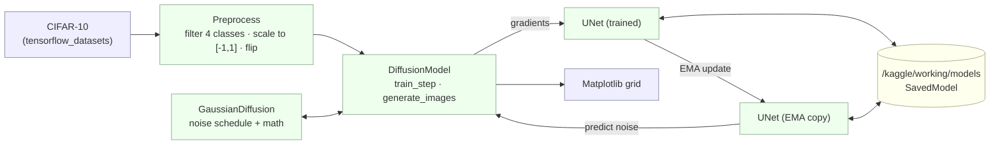
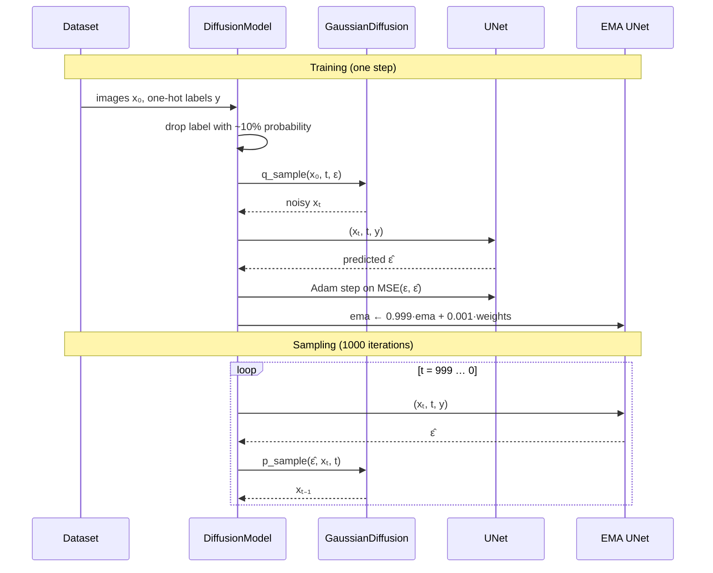

# ClassyDiffusion

> ⏱️ **2-minute read:** *What is this?*, the diagram, and *How It Works*.
> **10-minute read:** add Components, Decisions, and Numbers.
> **Deep dive:** [Architecture](architecture.md) → [Development](development.md).

## What is this?

ClassyDiffusion is a **Denoising Diffusion Probabilistic Model (DDPM)** built from scratch in **TensorFlow/Keras**. It lives in a single Jupyter notebook.

- A **UNet with self-attention** learns to predict the noise that was added to an image.
- The UNet is **conditioned on a class label**, so at sampling time you choose what it draws: airplane, car, bird, or cat.
- It trains on a 4-class, 20,000-image subset of **CIFAR-10** at 32×32.
- Sampling starts from pure Gaussian noise and removes noise over **1000 steps**.

> [!NOTE]
> The code calls the conditioning input `text` / `text_embeddings`, and the notebook is named "prompt-based". In practice this input is a **4-dimensional one-hot class vector**, not natural-language text.

## Project at a Glance

| Area | Technology / Approach |
|------|------------------------|
| Model type | DDPM, ε-prediction (the network predicts noise) |
| Network | UNet, widths 64→128→256→512, 2 residual blocks per level, single-head self-attention |
| Conditioning | Sinusoidal timestep embedding + one-hot class embedding, both added in every residual block |
| Framework | TensorFlow 2 / Keras functional API |
| Data | CIFAR-10 via `tensorflow_datasets`, labels 0–3 |
| Training | MSE loss, Adam (lr 2e-4), EMA decay 0.999, label dropout ~10% |
| Runtime | Kaggle GPU notebook, Python 3.10.13 |
| Persistence | Keras `model.save()` to `/kaggle/working/models/` |

## System in One Diagram

## How It Works

**Training**

1. **Load and filter:** read CIFAR-10 and keep labels 0–3, which gives 20,000 images.
2. **Preprocess:** scale pixels to `[-1, 1]` and apply a random horizontal flip. One-hot encode the labels.
3. **Noise:** pick a random timestep `t ∈ [0, 1000)` and noise the image in one shot: `xₜ = √ᾱₜ·x₀ + √(1-ᾱₜ)·ε`.
4. **Predict:** the UNet receives `(xₜ, t, label)` and predicts `ε̂`. The loss is `MSE(ε, ε̂)`.
5. **Update:** Adam updates the network, then the EMA copy is blended toward it.

**Sampling**

6. **Start:** draw pure noise `x₁₀₀₀ ~ N(0, I)` and a chosen one-hot label.
7. **Denoise:** at each step, the EMA UNet predicts noise. The code reconstructs a clipped `x̂₀`, computes the posterior mean, and adds scaled noise (no noise at t = 0).
8. **Display:** after 1000 steps, rescale to `[0, 255]` and plot the images with their class names.

## Important Components

Cell numbers are 0-indexed positions in the `.ipynb`. Search by name to find them.

| Component | Responsibility | Important Code |
|-----------|----------------|----------------|
| Hyperparameters | Image size, widths, attention flags, T, lr | cell 5 |
| Data pipeline | Load CIFAR-10, filter, one-hot, rescale, flip, shuffle | cells 9–16, 37–39 · `resize_and_rescale`, `batch_train_preprocessing` |
| `GaussianDiffusion` | Precomputes the β/ᾱ schedule. Implements `q_sample` (forward) and `p_sample` (reverse) | cell 17 |
| UNet building blocks | `ResidualBlock`, `AttentionBlock`, `TimeEmbedding`, `TimeMLP`, `TextMLP`, `DownSample`, `UpSample` | cell 18 |
| `build_model` | Assembles the UNet: 3 inputs (image, t, label) → noise | cell 18 |
| `DiffusionModel` | Custom `keras.Model` with `train_step`, EMA update, label dropout, sampling, and plotting | cell 20 |
| `text_to_image` | Samples images for labels you pass in | cell 31 |

## Key Technical Decisions

| Decision | Why | Tradeoff |
|----------|-----|----------|
| Predict noise ε, not x₀ | Standard DDPM objective. Gives a simple MSE loss | Sampling needs all 1000 sequential steps |
| Linear β schedule, 1e-4 → 0.02 | The original DDPM default | Cosine schedules often do better at low resolution (not tested here) |
| Attention only at the 8×8 and 4×4 levels | Attention cost grows with (H·W)², so it stays cheap at low resolution | No global attention at 32×32 or 16×16 |
| Condition by *adding* the class embedding in every residual block | Simple, and the same mechanism as the timestep embedding | Less expressive than cross-attention |
| Label dropout (keep probability 0.9) | Trains an unconditional mode, as in classifier-free guidance | **Guidance is never used at sampling time**, so the unconditional mode goes unused |
| Separate EMA network for sampling | Smoother weights, better samples | Two 64.8M-parameter models in memory |
| Hold the whole dataset in memory as tensors | Simple. 20k × 32×32×3 is small | Flip augmentation is applied once, not per epoch. Doesn't scale to large datasets |

## Important Numbers

All values come from the code or from saved cell outputs.

| Metric | Value | Source |
|--------|-------|--------|
| UNet parameters | **64,764,227** (247 MB fp32) | `network.summary()` |
| Training images | **20,000** (4 classes × 5,000) | filter cell output |
| Resolution | 32 × 32 × 3 | hyperparameters |
| Diffusion steps | 1,000 | `total_timesteps` |
| Logged training run | 25 epochs · batch 64 · 313 steps/epoch | `model.fit` output |
| Step time (logged run) | ~307 ms/step · ~96 s/epoch | `model.fit` output |
| Training loss (logged run) | 0.028–0.030 (flat, run resumed from a checkpoint) | `model.fit` output |
| GPU type, total training time | ⚠️ **UNKNOWN / NEEDS VERIFICATION.** Not recorded in the notebook | — |
| Sample quality (FID etc.) | ⚠️ **Not measured** | — |

## Known Limitations

- 🔁 **The notebook does not run top to bottom.** Execution counts are out of order, and `load_model` cells need checkpoints that aren't in the repo.
- 🐢 **Sampling is slow:** 1000 sequential `ema_network.predict()` calls per batch.
- 📏 **No quantitative evaluation.** Quality is judged only by eye from the plotted grids.
- 🧪 **Label dropout is trained, but classifier-free guidance isn't implemented.**
- 🏷️ **Misleading names:** "text" means a one-hot class vector. The hyperparameter cell comment says "STL-10", but the data is CIFAR-10.
- 📦 **No pinned dependencies**, no weights in the repo, no tests.

## Where To Go Next

- 🏗️ **[Architecture](architecture.md):** UNet layout, tensor shapes, data flow, failure points, scaling
- 🛠️ **[Development](development.md):** setup, configuration, how to run a clean training or sampling session
